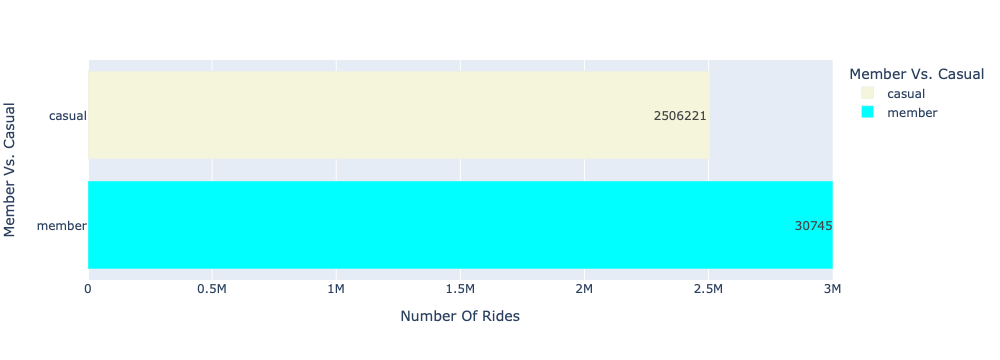
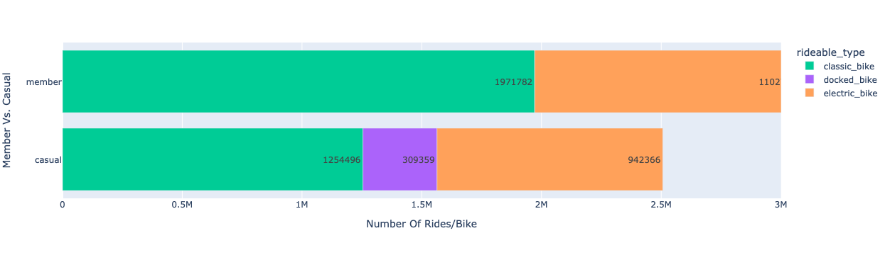
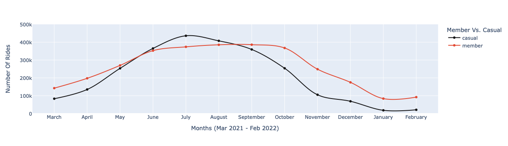
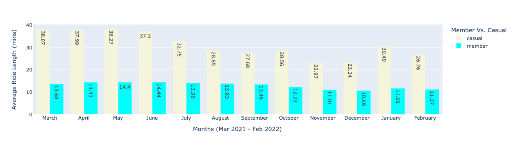
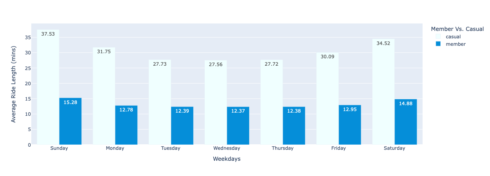
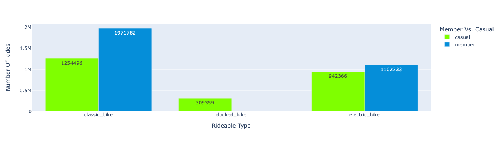

# Google Capstone Project 

# Introduction

This case study is the **Capstone Project** of ***[Google Data Analytics Professional Certificate](https://www.coursera.org/professional-certificates/google-data-analytics)*** . In this case study, I'm a junior data analyst on the marketing analyst team of Cyclistic, a fictitious Chicago bike-share firm.

Cyclistic is a bicycle-sharing scheme with over 5,800 bikes and 600 docking stations. Cyclistic distinguishes itself by including reclining bikes, hand tricycles, and cargo bikes in its fleet, making bike-share more accessible to persons with disabilities and others who can't ride a regular two-wheeled bike. The bulk of riders choose standard bikes, with only roughly 8% opting for assistive solutions. Although cyclists are more likely to ride for pleasure, about 30% of them use bikes to travel to work every day.

Cyclistic developed a successful bike-share programme in 2016. Since then, the initiative has grown to include a fleet of 5,824 bicycles that are geotracked and locked into 692 stations throughout Chicago. Bikes can be unlocked at any station and returned to any other in the system at any time.

The company's future prosperity, according to the director of marketing, hinges on increasing the number of yearly subscribers. As a result, my team is eager to learn more **how casual riders and annual members use Cyclistic bikes differently**. Our team will develop a new marketing plan based on the findings in order to convert casual riders into annual members. However, our recommendations must first be approved by Cyclistic management, therefore they must be backed up with evidence **compelling data insights and professional data visualizations**.

Single-ride passes, full-day passes, and annual memberships are all available. **Casual riders are customers who purchase single-ride or full-day passes**. **Cyclistic members are customers who purchase annual memberships**.

I followed the steps of the data analysis process to answer the key business questions: **ask**, **prepare**, **process**, **analyze**, **share**, and **act**.

# Ask

**The future marketing effort will be guided by three questions:** 
1. What are the differences in how annual members and casual riders use Cyclistic bikes? 
2. Why would a non-cyclist purchase a Cyclistic annual membership? 
3. How can Cyclistic use digital media to persuade non-members to join the club?

**The key stakeholders are:**
1. Cyclistic Executive Team.
2. Lily Moreno (Director of Marketing) & my Manager.

**Key tasks:**
1. Design marketing strategies aimed at converting casual riders into annual members. 

# Prepare

Evaluate and discover trends using Cyclistic's historical trip data. Here you can **[download the previous 12 months](https://divvy-tripdata.s3.amazonaws.com/index.html)** worth of Cyclistic trip data. **The datasets are appropriate for the objectives of this case study and will allow you to answer the business questions**. **Motivate International Inc. has made the data available under this [licence](https://ride.divvybikes.com/data-license-agreement)**. This is open data that you may use to investigate how various consumer categories utilise Cyclistic bikes. However, due to data-privacy concerns, you are unable to use riders' personally identifying information. This means you won't be able to link pass purchases to credit card numbers to see if casual riders live in the Cyclistic service region or bought multiple single passes.

The data is **accurate**, **trustworthy**, **consistent**. There are no issues with **bias** or **legitimacy** because this data is collected by a legitimate Chicago bike sharing firm. As a result, it's **Reliable**, **Original**, **Current**, and **Cited** as in **ROCCC**. I don't believe it is adequate because certain information is missing.

> **Limitations**

* No **financial information**.
* No **riders personal indentifiable information**.

# Process

### Importing libraries for data cleaning, manipulating and visualization

`import pandas as pd`

`from pandas.api.types import CategoricalDtype`

`import numpy as np`

`import seaborn as sns`

`import matplotlib.pyplot as plt`

`import plotly.express as px`

`from plotly.offline import download_plotlyjs, init_notebook_mode, plot, iplot`

`init_notebook_mode(connected=True)`

`import cufflinks as cf`

### Importing CSV files

`mar_2021 = pd.read_csv('202103-divvy-tripdata.csv')`

`apr_2021 = pd.read_csv('202104-divvy-tripdata.csv')`

`may_2021 = pd.read_csv('202105-divvy-tripdata.csv')`

`jun_2021 = pd.read_csv('202106-divvy-tripdata.csv')`

`jul_2021 = pd.read_csv('202107-divvy-tripdata.csv')`

`aug_2021 = pd.read_csv('202108-divvy-tripdata.csv')`

`sep_2021 = pd.read_csv('202109-divvy-tripdata.csv')`

`oct_2021 = pd.read_csv('202110-divvy-tripdata.csv')`

`nov_2021 = pd.read_csv('202111-divvy-tripdata.csv')`

`dec_2021 = pd.read_csv('202112-divvy-tripdata.csv')`

`jan_2022 = pd.read_csv('202201-divvy-tripdata.csv')`

`feb_2022 = pd.read_csv('202202-divvy-tripdata.csv')`

### Lets join all data sets into one data frame

`df = pd.concat([mar_2021,apr_2021,may_2021,jun_2021,jul_2021,aug_2021,sep_2021,oct_2021,nov_2021,dec_2021,jan_2022,feb_2022])`

# Analyze & Share

**Compare Annual members and Casual riders on the basis of some parameters, like:** 
* types of bike, 
* ride length, 
* year, months(seasons), 
* hours, 
* day of week..
 
## Figure1

* **Annual members** have more rides than **Casual riders**, as shown in the graph.

## Figure2

* The **Classic Bike** appears to be the most popular bike among both, but it is primarily used by **Annual Members**. 

## Figure3

* The frequency of rides for **Annual Members** increases from **June to October and remains consistent over that time period**.
* For **Casual Riders**, the number of rides is highest from **June to September, with July appearing to be the peak month in between**.

## Figure4

* According to this graph, the **Average** ride length for **Casual Riders** is **higher during the entire spring season and the first months of summer**.
* The **Average** ride length for **Annual Members** is very **consistent** throughout the year.

## Figure5

* **Casual members**, according to this graph, ride their bikes for **longer periods of time, especially on weekends**.
* **Annual members** generally tend to ride their bikes in a steady manner during the week, while on **weekends they ride for a little longer**.

## Figure6

# Act

### Final Conclusion Based On Analysis

* Cyclistic bike share is used **differently** by **annual members and casual users**.

* During the data analysis process, it was discovered that **Annual members** prefer to ride their bikes for **everyday commuting** because they don't ride for long periods of time and have **consistency** in their weekly rides. **Casual riders**, on the other hand, primarily use bikes on **weekends for outings**. nevertheless, some casual riders also use bikes for daily commutes because some of them have short rides.

* **Casual Riders** average ride length is **higher throughout the spring season and the first months of summer**, but **Annual Members** average ride length is **fairly steady throughout the year**. The frequency of rides for **Annual Members increases from June to October** and remains consistent throughout that time period; on the other hand, the frequency of rides for Non-Annual Members increases. From **June through September**, the number of **Casual riders** is at its highest, with **July looking to be the peak month in between**.

### Effective Use Of Insights

* Make an appealing annual membership package for **casual riders who utilise bikes for regular commutes**, especially for daily commuters. And that plan would include some sort of **seasonal or festive discount**, and when **promoting** the membership plan, the main focus should be on **email marketing**, with less emphasis on other media.

* And for the **casual riders who primarily use their bikes on weekends**. This set of riders should be offered the same annual membership package, but presented in a different way. There could be **coupons for some popular hot spots** for this segment of casual riders, and **social media** should be a big focus for **promotion**.

* These strategies can also be used to acquire **new clients**.

### Recommendation 

* Add some extra information for deeper analysis, such as financial information, membership plan details, personally identifiable information about clients, and bike type information. It would be more beneficial in improving the marketing strategy's effectiveness.
